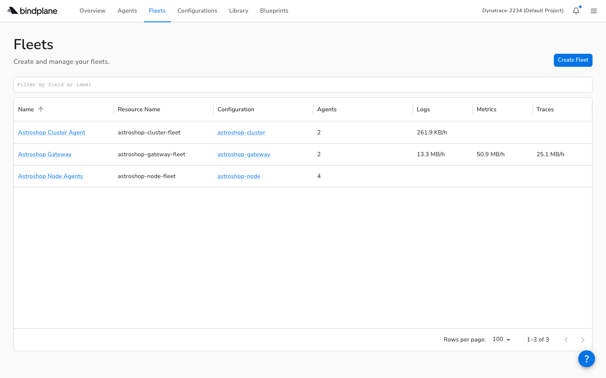
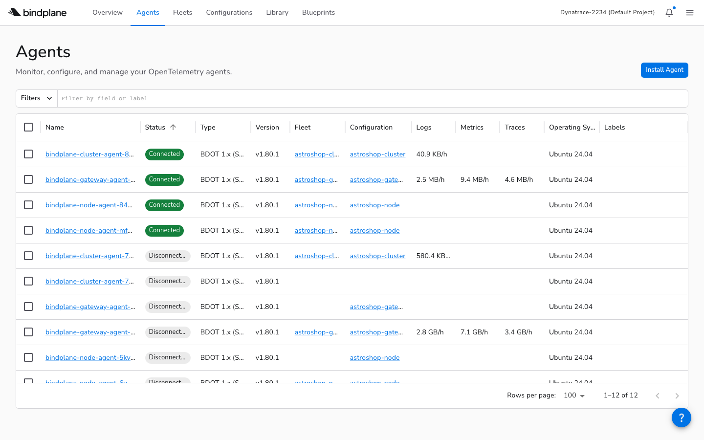

<!-- _class: title -->

# BindPlane Primer

**Managing OpenTelemetry Collectors at Scale**

---

# What You'll Learn

**Audience:** Engineers running OTel Collectors in Kubernetes who want centralized management

- Why managing collector configs at scale is painful
- How **BindPlane** solves this with a control plane approach
- The resource model: **sources, destinations, configurations, fleets**
- Deploying and operating a full collector fleet with the Astronomy Shop demo

---

<!-- _class: title -->

# The Problem

**What happens when you have more than one collector?**

---

# One Collector Is Easy

You write a `config.yaml`. You apply it with `kubectl`. It works.

But a real cluster has multiple collectors with different purposes:

- A **gateway** receiving OTLP from your apps
- A **node agent** on every node collecting container logs
- A **cluster agent** collecting Kubernetes events

Each has its own config file. Each needs to be updated independently.

---

# Five Collectors, Five Problems

Now you need to change the export destination from Jaeger to Dynatrace.

- Edit 5 config files
- Apply each one to the right workload
- Hope you didn't introduce a typo in one of them
- Do it again next month for the new cluster

The problem isn't deploying collectors. It's **managing their configurations across environments, over time, at scale**.

---

<!-- _class: title -->

# BindPlane

**One control plane for all your collectors**

---

# What BindPlane Does

**BindPlane** is a control plane for OpenTelemetry Collectors. You define configurations once. BindPlane delivers them to every collector that should receive them.

- Change a destination → **every matched collector updates**
- Add a new node → **its agent auto-joins the right group**
- Bad config? → **automatic rollback, no broken collectors**

Available as a cloud service at `app.bindplane.com` or self-hosted.

---

# How Agents Connect: OpAMP

Collectors managed by BindPlane are called **agents**. They connect using **OpAMP** (Open Agent Management Protocol) — an open standard.

- The agent initiates an **outbound WebSocket** to BindPlane
- BindPlane **never reaches into your network**
- Works through firewalls — no inbound ports needed

```
wss://app.bindplane.com/v1/opamp
```

---

<!-- _class: title -->

# The Building Blocks

**Four resources that define what your collectors do**

---

# Sources

A **source** defines where telemetry comes from. It's BindPlane's abstraction over an OTel receiver.

You define a source once. Any number of configurations can reference it. Change the source, and every configuration that uses it gets the update.

| Source type | What it collects |
|-------------|-----------------|
| `otlp` | Traces, metrics, logs via OTLP |
| `k8s_container` | Container logs from the node |
| `k8s_events` | Kubernetes event objects |

---

# Source YAML

Sources live in `bindplane/sources.yaml`:

```yaml
apiVersion: bindplane.observiq.com/v1
kind: Source
metadata:
  name: astroshop-otlp-source
spec:
  type: otlp
  parameters:
    - name: telemetry_types
      value: [Logs, Metrics, Traces]
    - name: grpc_port
      value: 4317
```

Apply with `bindplane apply -f bindplane/sources.yaml`

---

# Destinations

A **destination** defines where telemetry goes. It's BindPlane's abstraction over an OTel exporter.

Our setup has two destinations — and understanding why reveals a key architectural decision.

| Destination | Type | Purpose |
|------------|------|---------|
| `astroshop-otlp-export` | `dynatrace_otlp` | Ship to Dynatrace |
| `astroshop-gateway` | `bindplane_gateway` | Route to the gateway agent |

---

# Why Two Destinations?

We could have every agent export directly to Dynatrace.

But that means:
- API token on **every node** — more secrets to manage
- Multiple egress points to **monitor and firewall**
- More connections for the **backend to handle**

Instead: node agents forward to the **gateway**. The gateway is the only one that talks to Dynatrace. **One secret, one egress point**.

This is the **fan-in pattern**.

---

# Configurations

A **configuration** wires sources to destinations into a pipeline.

It is the unit of deployment — the thing you **version, roll out, and roll back**. Changing a configuration changes what an entire group of collectors does, without touching any of them individually.

```yaml
kind: Configuration
metadata:
  name: astroshop-gateway
spec:
  sources:
    - name: astroshop-otlp-source
  destinations:
    - name: astroshop-otlp-export
  selector:
    matchLabels:
      configuration: astroshop-gateway
```

---

# Fleets

If a configuration already has a label selector, why do you need **fleets**?

**Operational visibility.** A fleet gives you a named group you can monitor — agent count, combined throughput, version distribution, health status.

- A **configuration** is the unit of deployment
- A **fleet** is the unit of operations

```yaml
kind: Fleet
metadata:
  name: astroshop-gateway-fleet
spec:
  configuration: astroshop-gateway
```

---

<!-- _class: screenshot -->

# Fleets in the BindPlane UI



**SCREENSHOT:** BindPlane > Fleets page
- Three fleets: Gateway, Node, Cluster
- Each shows agent count and throughput
- **Key point:** One view for the entire collector fleet

---

<!-- _class: title -->

# The Project

**How the files are organized and why order matters**

---

# Repository Layout

Everything is YAML in a Git repo. Review changes in PRs. Deploy from CI.

```
bindplane/
├── sources.yaml              ← what to collect
├── gateway-destination.yaml  ← where to send (Dynatrace)
├── gateway-to-bindplane-destination.yaml  ← internal routing
├── gateway-config.yaml       ← pipeline: OTLP → Dynatrace
├── node-config.yaml          ← pipeline: logs → gateway
├── cluster-config.yaml       ← pipeline: events → gateway
├── fleets.yaml               ← agent grouping
├── k8s-gateway-agent.yaml    ← Kubernetes Deployment
├── k8s-node-agent.yaml       ← Kubernetes DaemonSet
└── k8s-cluster-agent.yaml    ← Kubernetes Deployment
```

---

# The Dependency Chain

These files **cannot** be applied in any order. Each resource references others by name.

| Step | What | Tool | Why this order |
|------|------|------|----------------|
| 1 | Sources + Destinations | `bindplane apply` | No dependencies |
| 2 | Configurations | `bindplane apply` | Reference sources + destinations |
| 3 | Fleets | `bindplane apply` | Reference configurations |
| 4 | K8s Manifests | `kubectl apply` | Agents that connect to BindPlane |
| 5 | Rollouts | `bindplane rollout start` | Push configs to connected agents |

---

# Applying Resources

Authenticate, then apply in dependency order:

```
bindplane profile set default \
  --api-key $BINDPLANE_API_KEY \
  --remote-url https://app.bindplane.com

bindplane apply -f bindplane/sources.yaml
bindplane apply -f bindplane/gateway-destination.yaml
bindplane apply -f bindplane/gateway-config.yaml
bindplane apply -f bindplane/fleets.yaml

bindplane get configurations   # verify
bindplane get fleets           # verify
```

At this point, BindPlane knows **what** to collect. But no agents are running yet.

---

<!-- _class: title -->

# The Three Agent Patterns

**Gateway, Node, and Cluster**

---

# The Gateway Agent

A Kubernetes **Deployment** that acts as the central routing point.

- Receives OTLP from the app's collector **and** from other agents
- Exports to Dynatrace — the **only** agent with external credentials
- The **only** agent that needs network access outside the cluster

```
env:
  - name: OPAMP_ENDPOINT
    value: wss://app.bindplane.com/v1/opamp
  - name: OPAMP_LABELS
    value: "configuration=astroshop-gateway,fleet=astroshop-gateway-fleet"
```

---

# The Node Agent

A **DaemonSet** — one pod per node. Collects what the gateway can't see.

| Feature | Why |
|---------|-----|
| **DaemonSet** | One per node — access to host filesystem |
| **hostPort 4317** | Local OTLP endpoint for pods on same node |
| **/var/log mount** | Read container log files from the host |
| **→ Gateway** | Forwards to gateway, not directly to backend |

Deploy: `kubectl apply -f bindplane/k8s-node-agent.yaml`

---

# The Cluster Agent

A single-replica **Deployment** for cluster-wide data.

Kubernetes events (pod scheduled, OOM killed) and cluster metrics are **global** — not per-node. A DaemonSet would collect the same events on every node.

One pod. One copy. No duplication. Forwards to the gateway.

Deploy: `kubectl apply -f bindplane/k8s-cluster-agent.yaml`

---

<!-- _class: screenshot -->

# The Full Architecture



**SCREENSHOT:** BindPlane > Agents page
- Gateway, Node, and Cluster agents all connected
- Each shows fleet, configuration, and throughput
- **Key point:** All three agent types managed from one control plane

---

<!-- _class: title -->

# Rollouts

**Pushing configurations safely**

---

# Why Phased Rollouts?

Applying a configuration makes it available. A **rollout** pushes it to agents.

Why not push immediately? Because pushing a bad config to a hundred agents at once would be **catastrophic**.

Rollouts are **phased**:
1. Push to a small batch
2. Watch for errors
3. Expand to more agents
4. If any agent rejects → **pause and roll back**

No agents are left in a broken state.

---

# Rollout Commands

```
$ bindplane rollout start astroshop-gateway

NAME                STATUS   COMPLETED  ERRORS  PENDING
astroshop-gateway:3 Started  0          0       1

$ bindplane rollout status astroshop-gateway

NAME                STATUS   COMPLETED  ERRORS  PENDING
astroshop-gateway:3 Stable   2          0       0
```

**Stable** = every agent accepted. **Error** = at least one rejected (auto-rolled back).

---

<!-- _class: title -->

# Kubernetes Details

**The parts BindPlane doesn't manage**

---

# What BindPlane Manages vs. What You Manage

There is a deliberate separation of concerns:

| BindPlane manages | You manage |
|-------------------|-----------|
| Pipeline config (sources, processors, destinations) | Container image and version |
| Config delivery via OpAMP | RBAC permissions |
| Phased rollouts | Resource limits |
| Fleet grouping | Security context |

BindPlane can change the pipeline remotely. Infrastructure changes require redeploying the manifest.

---

# OPAMP_LABELS: How Agents Find Their Config

BindPlane matches agents to configs using **labels**, not hostnames or IPs.

```yaml
env:
  - name: OPAMP_LABELS
    value: "configuration=astroshop-gateway,fleet=astroshop-gateway-fleet"
```

- `configuration=` matches the **Configuration's** `selector.matchLabels`
- `fleet=` matches the **Fleet's** `selector.matchLabels`

A new pod starts → labels match → fleet assigned → config pushed. **Automatic.**

---

# The Init Container

The agent needs a config file to start, but BindPlane sends the real config **after** it connects. And the container is read-only for security.

**Solution:** An init container writes a no-op bootstrap config into an `emptyDir` volume.

```yaml
initContainers:
  - name: setup-volumes
    command: ["sh", "-c"]
    args:
      - echo 'receivers: {nop:}
              exporters: {nop:}
              service: {pipelines: {metrics: {receivers: [nop], exporters: [nop]}}}
        ' > /etc/otel/storage/config.yaml
```

The agent starts with the no-op, connects to BindPlane, and immediately receives the real pipeline.

---

<!-- _class: title -->

# The Full Deploy

**Putting it all together**

---

# End-to-End Sequence

```
# 1. Apply BindPlane resources (dependency order)
bindplane apply -f bindplane/sources.yaml
bindplane apply -f bindplane/gateway-destination.yaml
bindplane apply -f bindplane/gateway-config.yaml
bindplane apply -f bindplane/node-config.yaml
bindplane apply -f bindplane/cluster-config.yaml
bindplane apply -f bindplane/fleets.yaml

# 2. Deploy agents to Kubernetes
kubectl create namespace bindplane-agent
kubectl apply -f bindplane/k8s-gateway-agent.yaml
kubectl apply -f bindplane/k8s-node-agent.yaml
kubectl apply -f bindplane/k8s-cluster-agent.yaml

# 3. Push configurations
bindplane rollout start astroshop-gateway
bindplane rollout start astroshop-node
bindplane rollout start astroshop-cluster
```

---

# The Astroshop Connection

The Astronomy Shop already has an OTel Collector. We add a second exporter that forwards to the BindPlane gateway.

```yaml
# astroshop-values.yaml
opentelemetry-collector:
  config:
    exporters:
      otlp/bindplane:
        endpoint: bindplane-gateway-agent.bindplane-agent.svc.cluster.local:4317
    service:
      pipelines:
        traces:
          exporters: [otlp/jaeger, otlp/bindplane]
        metrics:
          exporters: [otlphttp/prometheus, otlp/bindplane]
        logs:
          exporters: [opensearch, otlp/bindplane]
```

Both backends receive a copy. Existing observability continues to work.

---

<!-- _class: screenshot -->

# Gateway Pipeline in BindPlane


**SCREENSHOT:** BindPlane > Configurations > astroshop-gateway
- OTLP source on the left, Dynatrace destination on the right
- Throughput bars showing live data flow
- **Key point:** The pipeline you defined in YAML, visualized

---

<!-- _class: title -->

# Debugging

**What happens when things go wrong**

---

# A Real Rollout Failure

After rolling out the node configuration:

```
$ bindplane rollout status astroshop-node

NAME              STATUS  COMPLETED  ERRORS  PENDING
astroshop-node:1  Error   0          1       2
```

One agent rejected the config. Two are still waiting. But **what** was the error?

The CLI only shows the count. We had to check the pod logs:

```
$ kubectl logs -n bindplane-agent bindplane-node-agent-wblpl

"Failed applying remote config"
"error: 'metrics' has invalid keys: k8s.pod.volume.usage"
```

---

# The Fix

The BindPlane-generated config included a metric (`k8s.pod.volume.usage`) that agent v1.80.1 didn't support.

**What worked:** The agent rolled back gracefully. No broken state.

**The fix:** Remove the incompatible `k8s_kubelet` source from the node config, re-apply, re-rollout. Second rollout: **Stable**.

**The gap:** The error detail was only in `kubectl logs`, not in `bindplane rollout status`. The rollback itself was flawless.

---

<!-- _class: title -->

# Takeaways

---

# The Core Loop

1. Define **sources** and **destinations** as YAML
2. Wire them into **configurations**
3. Group agents into **fleets**
4. **Apply** resources, **deploy** agents, **rollout** configs
5. BindPlane delivers configs via **OpAMP** — agents handle the rest

Everything is a file in a repo. CI/CD follows naturally.

---

# What Makes It Practical

| Feature | Why it matters |
|---------|---------------|
| **GitOps** | Every resource is YAML. Review in PRs, deploy from CI |
| **Safe rollouts** | Phased delivery with automatic rollback |
| **Fleet grouping** | New nodes auto-join the right group via labels |
| **No server to run** | Cloud OpAMP — one WebSocket URL, agents connect out |
| **Fan-in architecture** | One gateway, one egress point, one set of credentials |

---

<!-- _class: title -->

# Resources

**Get started**

---

# Links

- **This primer:** `bp.mreider.com`
- **Full repo:** `github.com/mreider/astroshop-bindplane-labs`
- **BindPlane Cloud:** `app.bindplane.com`
- **BindPlane Docs:** `docs.bindplane.com`
- **OpAMP Spec:** `opentelemetry.io/docs/specs/opamp`
- **Astronomy Shop:** `opentelemetry.io/docs/demo`

Fork the repo. Fill in `.env`. Run `scripts/deploy.sh`.
