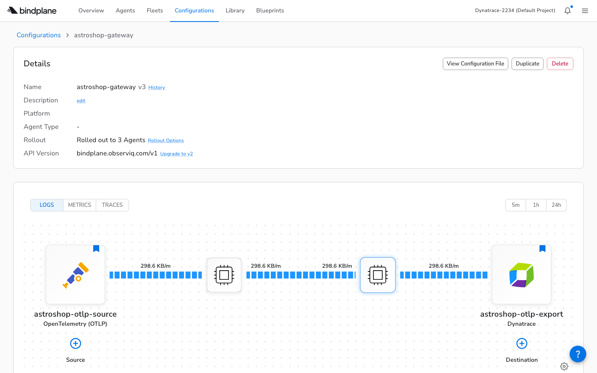

<!-- _class: title -->

# BindPlane Primer

**Managing OpenTelemetry Collectors at Scale**

---

# What You'll Learn

**Format:** Six modules, each followed by a hands-on lab

By the end you will have:
- A running **Astronomy Shop** on Kubernetes
- Three **BindPlane agents** collecting telemetry
- Telemetry flowing to **Dynatrace** through a gateway
- Everything defined as **YAML in a Git repo**

---

# What You'll Need

Before we start, confirm you have:

- A **BindPlane Cloud** account at `app.bindplane.com`
- A **Kubernetes cluster** with `kubectl` access
- **Helm** v4+ installed
- The **bindplane** CLI installed
- A **Dynatrace** environment with an API token (traces, metrics, logs ingest scopes)

---

<!-- _class: title -->

# Module 1

**The Problem and the Solution**

---

# One Collector Is Easy

You write a `config.yaml`. You apply it. It works.

But a real cluster has multiple collectors:

- A **gateway** receiving OTLP from your apps
- A **node agent** on every node collecting container logs
- A **cluster agent** collecting Kubernetes events

Each has its own config. Each changes independently.

---

# The Problem at Scale

Change the export destination from Jaeger to Dynatrace:

- Edit 5 config files
- Apply each to the right workload
- Hope you didn't introduce a typo
- Do it again next month for the new cluster

The problem isn't deploying collectors. It's **managing their configurations across environments, over time**.

---

# BindPlane

**BindPlane** is a control plane for OpenTelemetry Collectors.

You define configurations once. BindPlane delivers them to every collector that should receive them.

- Change a destination - **every matched collector updates**
- Add a new node - **its agent auto-joins the right group**
- Bad config? - **automatic rollback**

---

# OpAMP

Collectors managed by BindPlane are called **agents**. They connect using **OpAMP** (Open Agent Management Protocol).

- The agent initiates an **outbound WebSocket**
- BindPlane **never reaches into your network**
- No inbound ports, no VPN tunnels

```
wss://app.bindplane.com/v1/opamp
```

---

<!-- _class: title -->

# Lab 1

**Set up your environment**

---

# Lab 1: Install and Authenticate

**Step 1:** Install the BindPlane CLI

```
curl -L -o /tmp/bp.zip https://storage.googleapis.com/bindplane-op-releases/bindplane/latest/bindplane-ee-darwin-arm64.zip
unzip /tmp/bp.zip -d /tmp/bp && mv /tmp/bp/bindplane ~/bin/
```

**Step 2:** Authenticate with your API key

```
bindplane profile set default \
  --api-key YOUR_API_KEY \
  --remote-url https://app.bindplane.com
```

---

# Lab 1: Verify

**Step 3:** Confirm you can reach BindPlane Cloud

```
$ bindplane get agents

No matching resources found.
```

No agents yet. That's expected. The empty response confirms your CLI is authenticated.

---

<!-- _class: title -->

# Module 2

**Sources and Destinations**

---

# Sources

A **source** defines where telemetry comes from. It's BindPlane's version of an OTel receiver.

You define it once as a named resource. Any number of configurations can reference it. Change the source, every configuration that uses it gets the update.

| Source type | What it collects |
|-------------|-----------------|
| `otlp` | Traces, metrics, logs via OTLP |
| `k8s_container` | Container logs from the node |
| `k8s_kubelet` | Pod CPU, memory (kubelet-level) |
| `k8s_cluster` | Cluster-wide metrics |
| `k8s_events` | Kubernetes event objects |

---

# Destinations

A **destination** defines where telemetry goes. BindPlane's version of an OTel exporter.

Our setup needs two:

| Destination | Type | Purpose |
|------------|------|---------|
| `astroshop-otlp-export` | `dynatrace_otlp` | Final backend |
| `astroshop-gateway` | `bindplane_gateway` | Internal routing |

---

# Why Two Destinations?

We could have every agent export directly to Dynatrace. But that means:

- API token on **every node**
- Multiple **egress points** to monitor
- More **connections** for the backend to handle

Instead: node and cluster agents forward to the **gateway**. Only the gateway talks to Dynatrace. One secret, one egress point.

This is the **fan-in pattern**.

---

<!-- _class: title -->

# Lab 2

**Create sources and destinations**

---

# Lab 2: Write the Source File

Create `bindplane/sources.yaml`:

```yaml
apiVersion: bindplane.observiq.com/v1
kind: Source
metadata:
  name: astroshop-otlp-source
spec:
  type: otlp
  parameters:
    - name: telemetry_types
      value: [Logs, Metrics, Traces]
    - name: grpc_port
      value: 4317
    - name: http_port
      value: 4318
```

The full file in the repo has all five sources. For now, start with OTLP.

---

# Lab 2: Write the Destination Files

Create `bindplane/gateway-destination.yaml`:

```yaml
apiVersion: bindplane.observiq.com/v1
kind: Destination
metadata:
  name: astroshop-otlp-export
spec:
  type: dynatrace_otlp
  parameters:
    - name: deployment_type
      value: Custom
    - name: custom_url
      value: https://YOUR-ENV.dynatrace.com/api/v2/otlp
    - name: dynatrace_api_token
      value: "${DT_API_TOKEN}"
```

Replace `YOUR-ENV` with your Dynatrace environment.

---

# Lab 2: Apply and Verify

**Apply** the resources (order doesn't matter for sources and destinations):

```
bindplane apply -f bindplane/sources.yaml
bindplane apply -f bindplane/gateway-destination.yaml
bindplane apply -f bindplane/gateway-to-bindplane-destination.yaml
```

**Verify** they exist:

```
$ bindplane get sources
NAME                         TYPE   VERSION
astroshop-otlp-source        otlp   1

$ bindplane get destinations
NAME                         TYPE             VERSION
astroshop-otlp-export        dynatrace_otlp   1
astroshop-gateway            bindplane_gateway 1
```

---

<!-- _class: title -->

# Module 3

**Configurations and Fleets**

---

# Configurations

Sources and destinations are the inputs and outputs. A **configuration** wires them into a pipeline.

It is the unit of deployment: the thing you **version, roll out, and roll back**. Separating the configuration from the agents means you change what collectors do without touching them individually.

A configuration references sources and destinations **by name**. They must exist first.

---

# Three Configurations

| Config | Sources | Destination | Purpose |
|--------|---------|-------------|---------|
| `astroshop-gateway` | OTLP | Dynatrace | App telemetry to backend |
| `astroshop-node` | Container, OTLP | Gateway | Node data to gateway |
| `astroshop-cluster` | K8s Events | Gateway | Cluster data to gateway |

Node and cluster configs route to the **gateway**, not directly to Dynatrace. The gateway config is the only one with external credentials.

---

# Fleets

If configurations already have label selectors, why do you need **fleets**?

**Operational visibility.** A fleet is a named group you can monitor:

- Agent count
- Combined throughput (logs, metrics, traces per hour)
- Agent versions
- Health status

A **configuration** is the unit of deployment. A **fleet** is the unit of operations.

---

<!-- _class: title -->

# Lab 3

**Create configurations and fleets**

---

# Lab 3: Write a Configuration

Create `bindplane/gateway-config.yaml`:

```yaml
apiVersion: bindplane.observiq.com/v1
kind: Configuration
metadata:
  name: astroshop-gateway
  labels:
    configuration: astroshop-gateway
spec:
  measurementInterval: 1m
  sources:
    - name: astroshop-otlp-source
  destinations:
    - name: astroshop-otlp-export
  selector:
    matchLabels:
      configuration: astroshop-gateway
```

The `selector.matchLabels` determines which agents receive this config.

---

# Lab 3: Write the Fleets

Create `bindplane/fleets.yaml`:

```yaml
apiVersion: bindplane.observiq.com/v1
kind: Fleet
metadata:
  name: astroshop-gateway-fleet
  displayName: Astroshop Gateway
  labels:
    platform: kubernetes-gateway
    agent-type: observiq-otel-collector
spec:
  configuration: astroshop-gateway
selector:
  matchLabels:
    configuration: astroshop-gateway
```

The fleet's `spec.configuration` links it to the config from the previous step.

---

# Lab 3: Apply and Verify

**Apply** in dependency order (configs reference sources, fleets reference configs):

```
bindplane apply -f bindplane/gateway-config.yaml
bindplane apply -f bindplane/node-config.yaml
bindplane apply -f bindplane/cluster-config.yaml
bindplane apply -f bindplane/fleets.yaml
```

**Verify:**

```
$ bindplane get configurations
NAME                VERSION
astroshop-gateway   1
astroshop-node      1
astroshop-cluster   1

$ bindplane get fleets
NAME                         CONFIGURATION
astroshop-gateway-fleet      astroshop-gateway
```

---

<!-- _class: title -->

# Module 4

**The Three Agent Patterns**

---

# Gateway Agent

A Kubernetes **Deployment** that acts as the central routing point.

- Receives OTLP from the app's OTel Collector and other agents
- Exports to Dynatrace, the **only agent with external credentials**
- The **only agent that needs network access outside the cluster**

The manifest includes RBAC and a Service on ports 4317/4318. The agent starts with a bootstrap config, then BindPlane delivers the real pipeline via OpAMP.

---

# Node Agent

A **DaemonSet**, one pod per node. Collects what the gateway can't see.

| Feature | Why |
|---------|-----|
| DaemonSet | One per node, access to host filesystem |
| `hostPort` 4317 | Local OTLP endpoint for pods on same node |
| `/var/log` mount | Read container log files from the host |
| Routes to gateway | Not directly to backend |

Container logs live on the host filesystem. Only a pod running on that node can read them.

---

# Cluster Agent

A single-replica **Deployment** for cluster-wide data.

Kubernetes events (pod scheduled, OOM killed) and cluster metrics are **global**. A DaemonSet would collect the same events on every node.

One pod. One copy. No duplication. Routes to the gateway.

---

# How Agents Find Their Config

Agents report **labels** when they connect. BindPlane matches labels to configurations and fleets.

```yaml
env:
  - name: OPAMP_LABELS
    value: "configuration=astroshop-gateway,fleet=astroshop-gateway-fleet"
```

- `configuration=` matches the Configuration's `selector.matchLabels`
- `fleet=` matches the Fleet's `selector.matchLabels`

New pod starts, labels match, fleet assigned, config pushed. **Automatic.**

---

<!-- _class: title -->

# Lab 4

**Deploy the agents**

---

# Lab 4: Create the Namespace and Secret

Get the secret key agents use to authenticate with BindPlane:

```
$ bindplane secret get

01KPAT6TVX0Z2TP8H1ZWN47EZE (default)
```

Create a namespace and store the key as a Kubernetes secret:

```
kubectl create namespace bindplane-agent

kubectl -n bindplane-agent create secret generic \
  bindplane-agent-secret \
  --from-literal=secret-key="YOUR_SECRET_KEY"
```

---

# Lab 4: Deploy All Three Agents

Apply the three manifests from the repo:

```
kubectl apply \
  -f bindplane/k8s-gateway-agent.yaml \
  -f bindplane/k8s-node-agent.yaml \
  -f bindplane/k8s-cluster-agent.yaml
```

**Verify** pods are running:

```
$ kubectl get pods -n bindplane-agent

NAME                                    READY  STATUS
bindplane-gateway-agent-xxx             1/1    Running
bindplane-node-agent-yyy                1/1    Running
bindplane-cluster-agent-zzz             1/1    Running
```

---

# Lab 4: Verify Agents in BindPlane

Check that agents registered with BindPlane Cloud:

```
$ bindplane get agents

NAME                         VERSION  STATUS     FLEET
bindplane-gateway-agent-xxx  v1.80.1  Connected  astroshop-gateway-fleet
bindplane-node-agent-yyy     v1.80.1  Connected  astroshop-node-fleet
bindplane-cluster-agent-zzz  v1.80.1  Connected  astroshop-cluster-fleet
```

All three agents should show **Connected** and be assigned to their fleets via the `OPAMP_LABELS` in the manifests.

---

<!-- _class: title -->

# Module 5

**Rollouts**

---

# Why Not Push Immediately?

Applying a configuration makes it available. But agents are still running their bootstrap no-op config. A **rollout** pushes the real configuration to them.

Why the extra step? Because pushing a bad config to a hundred agents at once would be **catastrophic**.

Rollouts are **phased**:
1. Push to a small batch
2. Watch for errors
3. Expand to more agents
4. If any agent rejects the config - **pause and roll back**

---

# Rollout Lifecycle

| Status | Meaning |
|--------|---------|
| **Started** | Rollout in progress, pushing to agents |
| **Stable** | Every agent accepted the config |
| **Error** | At least one agent rejected (auto-rolled back) |
| **Paused** | Stopped by error or manually, waiting for action |

The agent that rejected the config reverts to its previous config. No agents are left broken.

---

<!-- _class: title -->

# Lab 5

**Roll out configurations**

---

# Lab 5: Start All Three Rollouts

Push configurations to the connected agents:

```
bindplane rollout start astroshop-gateway
bindplane rollout start astroshop-node
bindplane rollout start astroshop-cluster
```

---

# Lab 5: Verify Rollout Status

Check that all three reached **Stable**:

```
$ bindplane rollout status astroshop-gateway

NAME                STATUS  COMPLETED  ERRORS
astroshop-gateway:1 Stable  2          0

$ bindplane rollout status astroshop-node

NAME              STATUS  COMPLETED  ERRORS
astroshop-node:1  Stable  3          0

$ bindplane rollout status astroshop-cluster

NAME                STATUS  COMPLETED  ERRORS
astroshop-cluster:1 Stable  1          0
```

If any show **Error**, check the agent pod logs with `kubectl logs -n bindplane-agent <pod-name>`.

---

# When a Rollout Fails

Rollback is the feature that matters. Here is what it looks like when the safety net fires.

```
$ bindplane rollout status astroshop-node

NAME              STATUS  COMPLETED  ERRORS  PENDING
astroshop-node:1  Error   0          1       2
```

One agent rejected the config. Two were held back. The CLI shows the count, but not **what** went wrong.

---

# Finding the Error

Check the pod logs on the rejecting agent:

```
$ kubectl logs -n bindplane-agent bindplane-node-agent-wblpl

"Failed applying remote config"
"error: 'metrics' has invalid keys: k8s.pod.volume.usage"
```

The BindPlane-generated config included a metric the agent version didn't support.

**What worked:** the agent rolled back automatically. No broken state.

**The fix:** remove the incompatible source, re-apply, re-rollout. Second rollout: **Stable**.

---

<!-- _class: title -->

# Module 6

**The Application**

---

# Connecting the Astronomy Shop

The Astronomy Shop ships with its own OTel Collector. It already sends to Jaeger, Prometheus, and OpenSearch.

We **add** a second exporter that forwards a copy of everything to the BindPlane gateway. The original observability continues to work alongside BindPlane.

The exporter uses Kubernetes service DNS to reach the gateway:

```
bindplane-gateway-agent.bindplane-agent.svc.cluster.local:4317
```

---

# Helm Values Override

The `astroshop-values.yaml` file adds our exporter to every pipeline:

```yaml
opentelemetry-collector:
  config:
    exporters:
      otlp/bindplane:
        endpoint: bindplane-gateway-agent.bindplane-agent.svc.cluster.local:4317
        tls:
          insecure: true
    service:
      pipelines:
        traces:
          exporters: [otlp/jaeger, otlp/bindplane]
        metrics:
          exporters: [otlphttp/prometheus, otlp/bindplane]
        logs:
          exporters: [opensearch, otlp/bindplane]
```

---

<!-- _class: title -->

# Lab 6

**Deploy the Astronomy Shop**

---

# Lab 6: Install with Helm

Add the chart repo and deploy:

```
helm repo add open-telemetry \
  https://open-telemetry.github.io/opentelemetry-helm-charts
helm repo update

helm upgrade --install astroshop \
  open-telemetry/opentelemetry-demo \
  -f astroshop-values.yaml \
  --namespace astroshop \
  --create-namespace
```

---

# Lab 6: Verify End-to-End

**Check pods** are running:

```
$ kubectl get pods -n astroshop | head -5

NAME                         READY  STATUS
frontend-xxx                 1/1    Running
checkout-xxx                 1/1    Running
otel-collector-xxx           1/1    Running
```

**Check throughput** in BindPlane:

```
$ bindplane get agents

NAME                        LOGS      METRICS    TRACES
bindplane-gateway-agent-xx  2.5 MB/h  9.4 MB/h   4.6 MB/h
```

Non-zero throughput means telemetry is flowing through the gateway to Dynatrace.

---

# Lab 6: Confirm in Dynatrace

Open your Dynatrace environment and find data from the Astronomy Shop:

- **Traces:** Distributed Traces, filter by service `frontend` or `checkout`
- **Metrics:** Data Explorer, filter by `k8s.namespace.name=astroshop`
- **Logs:** Logs & Events, filter by `k8s.namespace.name=astroshop`

If each view shows data, the pipeline from app to gateway to Dynatrace is end-to-end live. **That's the goal this primer set out to reach.**

---

<!-- _class: screenshot -->

# Verify the Pipeline



**SCREENSHOT:** BindPlane > Configurations > astroshop-gateway
- OTLP source on the left, Dynatrace on the right
- Live throughput bars showing data flow
- **Key point:** The YAML you wrote, visualized

---

<!-- _class: title -->

# Takeaways

---

# The Core Loop

1. Define **sources** and **destinations** as YAML
2. Wire them into **configurations**
3. Group agents into **fleets**
4. **Apply** resources, **deploy** agents, **rollout** configs
5. BindPlane delivers configs via **OpAMP**

Everything is a file in a repo. CI/CD follows naturally.

---

# What Makes It Practical

| Feature | Why it matters |
|---------|---------------|
| **GitOps** | Every resource is YAML. Review in PRs, deploy from CI |
| **Safe rollouts** | Phased delivery with automatic rollback |
| **Fleet grouping** | New nodes auto-join the right group via labels |
| **No server to run** | Cloud OpAMP: one URL, agents connect out |
| **Fan-in** | One gateway, one egress point, one set of credentials |

---

<!-- _class: title -->

# Resources

---

# Links and Next Steps

- **This primer:** `bp.mreider.com`
- **Full repo:** `github.com/mreider/astroshop-bindplane-labs`
- **BindPlane Cloud:** `app.bindplane.com`
- **BindPlane Docs:** `docs.bindplane.com`
- **OpAMP Spec:** `opentelemetry.io/docs/specs/opamp`
- **Astronomy Shop:** `opentelemetry.io/docs/demo`

Fork the repo. Fill in `.env`. Run `scripts/deploy.sh`.
